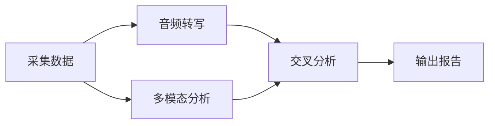

# 抖音账号诊断工具

> 你的抖音运营不能再凭感觉了。每条视频都在帮你积累数据——但大多数人的数据躺在后台，一条分析都没做过。
>
> 本项目把抖音账号诊断从「凭经验猜」升级为「数据驱动」：一键采集 → 结构化分析 → 输出可执行的改进方案。CLI 输出纯 JSON，任何 AI agent 都能调用。

账号分析经验来自大量研究报告和大 V 思路的蒸馏（钩子理论、内容结构拆解、互动率基准），不是泛泛的「多拍高质量视频」。

```shell
python3 bridge/videoagent_bridge.py fetch-creator <url> dy
python3 bridge/videoagent_bridge.py extract-audio <url> dy
python3 bridge/videoagent_bridge.py analyze-video <url> dy
```

---

## 核心能力

- **一键采集**全量视频数据（点赞、评论、收藏、分享、发布时间）
- **音频提取 + 语音转写**（faster-whisper），拿到口播文案
- **视频深度分析**（多模态 + 文本），识别钩子类型、内容结构、CTA
- **创作者对标调研**（粉丝数、简介、内容方向）
- **关键词趋势搜索**（话题下的热门视频），用于选题素材调研
- **结构化诊断报告**，输出到 CLI stdout，可被任何 agent 消费

---

## 前置依赖

| 依赖 | 版本 | 用途 | 安装方式 |
|------|------|------|---------|
| Python | 3.10+ | 运行环境 | — |
| [MediaCrawler](https://github.com/NanmiCoder/MediaCrawler) | — | 抖音数据抓取 | 独立安装，需扫码登录 |
| yt-dlp | 最新 | 视频/音频下载 | `brew install yt-dlp` 或 `pip install yt-dlp` |
| ffmpeg | 最新 | 音视频处理 | `brew install ffmpeg` 或 `apt install ffmpeg` |
| faster-whisper | — | 语音转写 | `pip install faster-whisper` |
| openai | — | 多模态 API 调用 | `pip install openai` |

### 可选依赖

视频多模态分析需要 **Seed 2.0**（或兼容的 Responses API）API key。不配置时仍可完成数据采集和音频转写，只是缺少视觉分析。

---

## 安装

```bash
# 1. 克隆仓库
git clone <repo-url> diagnosis
cd diagnosis

# 2. 安装 Python 依赖
pip install -r requirements.txt

# 3. 安装外部工具
brew install yt-dlp ffmpeg     # macOS
# apt install yt-dlp ffmpeg    # Linux

# 4. 安装 MediaCrawler（独立项目，克隆到 diagnosis 同级的目录）
cd .. && git clone https://github.com/NanmiCoder/MediaCrawler
cd MediaCrawler && pip install -r requirements.txt
cd ../diagnosis
# 首次运行 python main.py --platform dy --lt qrcode 扫码登录

# 5. 配置环境变量
cp .env.example .env
# 编辑 .env，填写必要配置
```

---

## 配置

```bash
cp .env.example .env
```

| 环境变量 | 必需 | 说明 |
|---------|------|------|
| `MEDIACRAWLER_PATH` | 否 | MediaCrawler 项目目录的绝对路径（按默认路径安装到同级目录则不需要） |
| `LLM_API_KEY` | 否 | 多模态视频分析的 API key（不配则不做画面分析） |
| `LLM_BASE_URL` | 否 | API 地址，默认 `https://ark.cn-beijing.volces.com/api/v3` |
| `LLM_MODEL` | 否 | 模型名称（Seed 2.0 的接入点名称） |

---

## CLI 用法

### 1. 数据采集

从抖音创作者主页 URL 抓取全部作品数据：

```bash
python3 bridge/videoagent_bridge.py fetch-creator "https://www.douyin.com/user/{sec_uid}" dy
```

输出：
```json
{
  "status": "ok",
  "creator": {
    "nickname": "账号昵称",
    "follower_count": "5914",
    "desc": "简介"
  },
  "videos": [
    {
      "id": "123456",
      "title": "视频标题",
      "likes": 31501,
      "comments": 1333,
      "favorites": 25358,
      "shares": 35720,
      "create_time": "2025-01-09"
    }
  ],
  "total_clean": 71,
  "data_sufficiency": {
    "flag": "ok",
    "video_count": 71,
    "date_range": "2024-07-20 ~ 2025-10-19",
    "time_span_days": 456,
    "avg_per_month": 4.4,
    "gap_count": 2
  }
}
```

数据自动持久化到 `store/accounts/{昵称}/raw_data/`。

### 2. 音频提取 + 转写

```bash
python3 bridge/videoagent_bridge.py extract-audio "https://www.douyin.com/video/{id}" dy "账号昵称"
```

如果指定第三个参数（账号昵称），转写结果自动存到 `store/accounts/{昵称}/analysis/`。

输出：
```json
{
  "url": "https://www.douyin.com/video/xxx",
  "platform": "dy",
  "duration_seconds": 45,
  "transcript": "转写后的口播文案全文...",
  "status": "ok"
}
```

### 3. 视频深度分析（含多模态）

```bash
python3 bridge/videoagent_bridge.py analyze-video "https://www.douyin.com/video/{id}" dy "账号昵称"
```

需配置 `LLM_API_KEY`。输出含钩子类型、内容风格、CTA 类型等结构化分析。

### 4. 创作者粉丝数查询（对标调研）

搜索创作者昵称，从 MediaCrawler 缓存获取粉丝数、简介等信息。用于验证对标账号的粉丝量和账号方向：

```bash
python3 bridge/videoagent_bridge.py lookup-creator dy "年糕妈妈"
```

输出：
```json
{
  "status": "ok",
  "profile": {
    "follower_count": "9422148",
    "nickname": "年糕妈妈",
    "desc": "浙大医学硕士 | 三兄弟的妈妈..."
  }
}
```

匹配策略：先精确匹配昵称，失败则取发该关键词视频数最多的作者。如果搜索结果中有多个疑似账号（视频数接近），返回 `ambiguous`。

**注意**：首次查询未缓存过的创作者会触发 MediaCrawler 抓取（较慢），后续查询直接从缓存读取。区别于 `search`（搜内容找热门视频）和 `fetch-creator`（抓某个创作者的完整作品列表）。

### 5. 关键词搜索（素材调研）

在抖音搜索某个话题下的热门视频，用于找对标、研究选题：

```bash
python3 bridge/videoagent_bridge.py search dy "混合喂养" --min-likes 2000
python3 bridge/videoagent_bridge.py search dy "坐月子" --min-likes 5000
python3 bridge/videoagent_bridge.py search dy "产后恢复" --min-likes 1000
```

**注意**：这是"搜内容"（找话题下的热门视频），区别于 `fetch-creator` 的"搜账号"（抓取某个创作者的全部视频）和 `lookup-creator` 的"查粉丝数"。`--min-likes` 过滤低赞内容。搜索结果仅包含标题、互动数等字段，不会下载视频或做内容分析。

---

## Agent 集成

本项目 CLI 统一输出 JSON 到 stdout，任何支持 Bash 的 agent 都可直接使用。

### Claude Code（原生集成）

本项目内置 `SKILL.md`，Claude Code 中可直接用自然语言操作：

```
分析一下抖音账号 https://www.douyin.com/user/xxx
```

### Codex / Windsurf / Trae

这些 agent 不支持 SKILL.md，但可通过 CLI 命令集成。在项目规则文件中添加：

```
# 抖音账号诊断工具
# 采集: python3 bridge/videoagent_bridge.py fetch-creator <url> dy
# 转写: python3 bridge/videoagent_bridge.py extract-audio <url> dy "昵称"
# 分析: python3 bridge/videoagent_bridge.py analyze-video <url> dy "昵称"
# 对标: python3 bridge/videoagent_bridge.py lookup-creator dy "昵称"
# 搜索: python3 bridge/videoagent_bridge.py search dy "关键词" --min-likes 2000
#
# 所有命令输出 JSON 到 stdout，诊断框架见 references/ 目录和 SKILL.md。
```

或直接在对话中告诉 agent：

> 这个项目在 `bridge/videoagent_bridge.py` 提供 CLI 命令，输出 JSON。
> 用 `fetch-creator` 抓取数据，然后分析回传的 JSON。

---

## 诊断流程

完整的诊断流程：



1. **采集数据** → `fetch-creator`（得到视频列表 + 互动数据）
2. **分析内容** → 对重要视频做 `extract-audio`（得到口播文案）
3. **多模态分析** → `analyze-video`（画面、场景、人物出镜分析）
4. **交叉分析** → 对比爆款 vs 低互动视频的内容结构差异
5. **输出报告** → 生成 HTML 诊断报告

详细诊断框架见 `SKILL.md` 和 `references/` 目录。

---

## 项目结构

```
diagnosis/
├── bridge/                    # CLI 入口（所有 agent 通用）
│   └── videoagent_bridge.py
├── references/                # 诊断知识库
│   ├── 赛道基准/
│   ├── 分析框架/
│   └── 改进手册/
├── store/                     # 数据持久化
│   ├── storage.py
│   └── accounts/{昵称}/
├── .env.example
├── SKILL.md                   # Claude Code 集成
└── ARCHITECTURE.md            # 架构文档
```

---

## License

MIT
